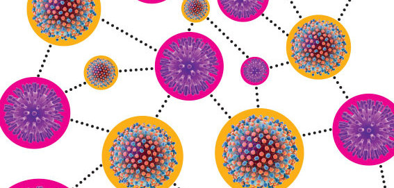

# Portfolio

---

## Data Science Projects 

### [Deep Learning: Multispectral Satellite Image Classification with VGG16](https://github.com/ayonantonio04/sat4VGG_project)

---
### [Predicting Movie Reviews On Word2Vec Data](https://github.com/ayonantonio04/ML_Classifier_Applications_on_Word2VecData)

---
### [Patterns In DNA: Report & Analysis](https://github.com/ayonantonio04/R_Project_Series/blob/master/Case_Study_3/Case_Study_3_Report.pdf)

---

## Additional Projects

- [Sentiment Analyzer on Billboard Songs](https://github.com/ayonantonio04/Sentiment_Analyzer-Billboard_Songs/blob/master/FinalProject_group152.ipynb)
- [Students Relationship With Vidogames: Report & Analysis](https://github.com/ayonantonio04/R_Project_Series/blob/master/Case_Study_2/CaseStudy_2_Report.pdf)
- [Project Report: Minigame To Promote Nutrition For Children](Life_Skills_Minigame_Report.pdf)

---

---

Page template forked from <a href="https://github.com/evanca/quick-portfolio">evanca</a>

<!-- Remove above link if you don't want to attibute -->
